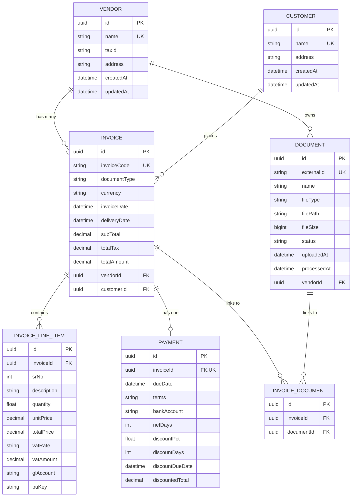

# Database Schema - ER Diagram

## Entity Relationship Diagram



## Schema Overview

### Tables and Relationships

1. **vendors** (12 records)
   - Primary table for vendor information
   - One-to-many with invoices
   - One-to-many with documents

2. **customers** (10 records)
   - Customer information
   - One-to-many with invoices

3. **documents** (50 records)
   - Document metadata
   - Many-to-one with vendors
   - Many-to-many with invoices (via junction table)

4. **invoices** (50 records)
   - Core invoice records
   - Many-to-one with vendors
   - Many-to-one with customers
   - One-to-many with line items
   - One-to-one with payment
   - Many-to-many with documents

5. **invoice_line_items** (665 records)
   - Invoice line items with GL accounts
   - Many-to-one with invoices
   - Includes GL account classification

6. **payments** (50 records)
   - Payment terms and due dates
   - One-to-one with invoices
   - Includes discount information

7. **invoice_documents** (Junction table)
   - Links invoices to documents
   - Many-to-many relationship

### Indexes

**Performance Optimizations:**

```sql
-- invoices table
CREATE INDEX idx_invoices_date ON invoices(invoice_date);
CREATE INDEX idx_invoices_vendor ON invoices(vendor_id);
CREATE INDEX idx_invoices_customer ON invoices(customer_id);

-- documents table
CREATE INDEX idx_documents_vendor ON documents(vendor_id);
CREATE INDEX idx_documents_uploaded ON documents(uploaded_at);

-- payments table
CREATE INDEX idx_payments_due_date ON payments(due_date);
```

### Key Constraints

1. **Primary Keys**: UUID on all tables
2. **Unique Constraints**: 
   - vendor.name
   - customer.name
   - document.externalId
   - invoice.invoiceCode
   - payment.invoiceId
3. **Foreign Keys**: All relationships enforced
4. **Cascade Deletes**: 
   - invoice_line_items → ON DELETE CASCADE
   - payments → ON DELETE CASCADE
   - invoice_documents → ON DELETE CASCADE

### Data Types

- **IDs**: UUID (unique, secure)
- **Amounts**: DECIMAL(15, 2) (precision for currency)
- **Dates**: DATETIME (timezone-aware)
- **Text**: VARCHAR with appropriate lengths
- **File Size**: BIGINT (supports large files)

### Normalization

**Third Normal Form (3NF) achieved:**

1. **First Normal Form (1NF)**:
   - ✅ Atomic values in all columns
   - ✅ No repeating groups
   - ✅ Primary keys defined

2. **Second Normal Form (2NF)**:
   - ✅ All non-key attributes fully dependent on primary key
   - ✅ No partial dependencies

3. **Third Normal Form (3NF)**:
   - ✅ No transitive dependencies
   - ✅ Vendor details in vendors table (not duplicated in invoices)
   - ✅ Customer details in customers table
   - ✅ Document metadata separate from invoices

### Sample Data Statistics

```sql
-- Total Records
SELECT 
  'Vendors' as table_name, COUNT(*) as count FROM vendors
UNION ALL
SELECT 'Customers', COUNT(*) FROM customers
UNION ALL
SELECT 'Documents', COUNT(*) FROM documents
UNION ALL
SELECT 'Invoices', COUNT(*) FROM invoices
UNION ALL
SELECT 'Line Items', COUNT(*) FROM invoice_line_items
UNION ALL
SELECT 'Payments', COUNT(*) FROM payments;

-- Result:
-- Vendors: 12
-- Customers: 10
-- Documents: 50
-- Invoices: 50
-- Line Items: 665
-- Payments: 50
```

### Common Queries

**1. Get Invoice with All Details:**
```sql
SELECT 
  i.invoice_code,
  i.invoice_date,
  v.name as vendor_name,
  c.name as customer_name,
  i.total_amount,
  p.due_date,
  p.terms
FROM invoices i
LEFT JOIN vendors v ON i.vendor_id = v.id
LEFT JOIN customers c ON i.customer_id = c.id
LEFT JOIN payments p ON p.invoice_id = i.id
WHERE i.id = 'some-uuid';
```

**2. Get Top Vendors by Spend:**
```sql
SELECT 
  v.name,
  COUNT(i.id) as invoice_count,
  SUM(i.total_amount) as total_spend
FROM vendors v
JOIN invoices i ON v.id = i.vendor_id
GROUP BY v.id, v.name
ORDER BY total_spend DESC
LIMIT 10;
```

**3. Get Spending by GL Account:**
```sql
SELECT 
  il.gl_account,
  COUNT(DISTINCT i.id) as invoice_count,
  SUM(il.total_price) as total_spend
FROM invoice_line_items il
JOIN invoices i ON il.invoice_id = i.id
WHERE il.gl_account IS NOT NULL
GROUP BY il.gl_account
ORDER BY total_spend DESC;
```

**4. Get Overdue Invoices:**
```sql
SELECT 
  i.invoice_code,
  v.name as vendor,
  i.total_amount,
  p.due_date,
  CURRENT_DATE - p.due_date as days_overdue
FROM invoices i
JOIN vendors v ON i.vendor_id = v.id
JOIN payments p ON p.invoice_id = i.id
WHERE p.due_date < CURRENT_DATE
ORDER BY p.due_date;
```

## Visual Representation

```
┌─────────────┐
│   VENDOR    │───────┐
└─────────────┘       │
      │               │
      │ has many      │ owns
      ▼               ▼
┌─────────────┐   ┌─────────────┐
│   INVOICE   │   │  DOCUMENT   │
└─────────────┘   └─────────────┘
      │               │
      │ placed by     │ links to
      │               │
      ▼               ▼
┌─────────────┐   ┌──────────────────┐
│  CUSTOMER   │   │ INVOICE_DOCUMENT │
└─────────────┘   └──────────────────┘
                        │
      ┌─────────────────┼─────────────────┐
      │                 │                 │
      ▼                 ▼                 ▼
┌─────────────┐   ┌─────────────┐   ┌─────────────┐
│   PAYMENT   │   │ LINE_ITEM   │   │  (INVOICE)  │
└─────────────┘   └─────────────┘   └─────────────┘
   (1-to-1)         (1-to-many)      (many-to-many)
```

## Database Size

```sql
-- Check table sizes
SELECT 
    schemaname,
    tablename,
    pg_size_pretty(pg_total_relation_size(schemaname||'.'||tablename)) AS size
FROM pg_tables
WHERE schemaname = 'public'
ORDER BY pg_total_relation_size(schemaname||'.'||tablename) DESC;
```

**Estimated Size:**
- Total: ~2-3 MB with 50 invoices
- Scales linearly with data
- Indexes add ~10-15% overhead

## Backup Strategy

**For Production:**

```bash
# Backup database
pg_dump $DATABASE_URL > backup_$(date +%Y%m%d).sql

# Restore database
psql $DATABASE_URL < backup_20241109.sql
```

## Migration History

1. **Initial Migration**: Created all 7 tables
2. **Seed Migration**: Imported 50 invoices from JSON
3. **Index Migration**: Added performance indexes
4. **Constraint Migration**: Added unique constraints

All managed via Prisma migrations.

---

**This schema is production-ready and follows PostgreSQL best practices!** ✅
